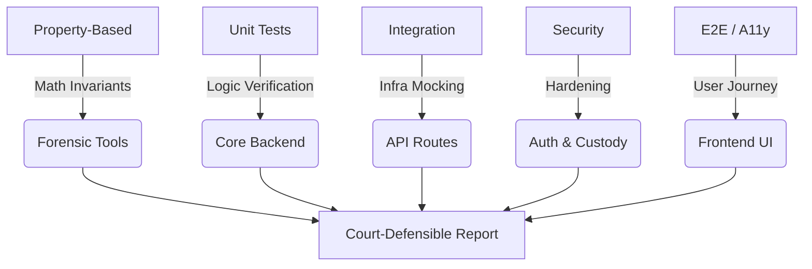

# Testing Guide — Forensic Council

**Version:** v1.5.0 | Comprehensive Forensic & App Testing Reference.

---

## 🏗️ Test Architecture

The Forensic Council testing suite is designed for **Legal Admissibility**. Every layer, from mathematical forensic invariants to the UI's cryptographic verification, is covered by a multi-modal testing strategy.



---

## 📂 Test Inventory

### ⚖️ Forensic Logic & Mathematical Invariants
| File | Aspect Tested | Dependencies | Coverage |
| :--- | :--- | :--- | :--- |
| `test_forensic_properties.py` | Forensic algorithm robustness | `Hypothesis`, `Pillow`, `NumPy` | Validates ELA/JPEG Ghost invariants across millions of generated inputs (boundary cases, 1x1 images, overflow). |
| `test_forensic_system.py` | Multi-agent pipeline flow | `pytest-asyncio`, Redis Mock | Orchestration of all 5 agents + Arbiter synthesis; verifies context injection (A1 -> A3/A5). |

### 🛡️ Cryptographic Integrity & Security
| File | Aspect Tested | Dependencies | Coverage |
| :--- | :--- | :--- | :--- |
| `test_custody_chain_integration.py` | Chain of Custody (CoC) | `cryptography`, ECDSA P-256 | Cryptographic linking of hashes; tamper-detection in the PostgreSQL-backed ledger. |
| `test_security.py` | API & JWT Hardening | `PyJWT`, `httpx` | SQLi in Case IDs, JWT `alg=none` attacks, role escalation, and rate-limit enforcement. |
| `test_config_signing_schemas.py` | DTO & Signing Logic | `pydantic`, `ECDSA` | Validates that every report is deterministically signed and schema-compliant. |

### 👤 Authentication & Session State
| File | Aspect Tested | Dependencies | Coverage |
| :--- | :--- | :--- | :--- |
| `test_auth.py` (Backend) | Identity Management | `passlib` (bcrypt) | Password hashing, JWT creation/refresh, and UserRole RBAC guards. |
| `api.test.ts` (Frontend) | Auth Lifecycle | `Jest`, `sessionStorage` | Token storage, auto-login, and header injection for the API client. |
| `schemas_utils.test.ts` | Data Validation | `Zod` | Ensures the frontend rejects malformed agent findings or corrupted reports. |

### 🌐 API & Integration Surface
| File | Aspect Tested | Dependencies | Coverage |
| :--- | :--- | :--- | :--- |
| `test_api_routes.py` | REST Endpoint Health | `FastAPI TestClient`, `magic` | 200/4xx/5xx status codes, MIME-type allow-lists, and CORS header reflection. |
| `websocket_flow.test.ts` | Real-time Analysis | `Playwright`, `WS-Mocks` | State machine transitions for the live analysis dashboard (8 distinct message types). |
| `useForensicData.test.ts` | Data Transformation | `Jest` | Mapping backend DTOs to UI models; calibration and court-statement formatting. |

### ♿ UI & Accessibility (WCAG 2.1 AA)
| File | Aspect Tested | Dependencies | Coverage |
| :--- | :--- | :--- | :--- |
| `accessibility.spec.ts` | Automated A11y Audit | `Playwright`, `axe-core` | Full-page runtime audits; verifies color contrast, heading hierarchy, and modal focus. |
| `accessibility.test.tsx` | Component A11y | `RTL`, `jest-axe` | Keyboard navigation (Tab/Enter), ARIA labels, and screen-reader error announcements. |
| `components.test.tsx` | UI Interactions | `React Testing Library` | Render states for `FileUploadSection` and `AgentProgressDisplay`. |

---

## 🚀 Running Tests

### 🐍 Backend (Python 3.12+)
Run from `apps/api` using `uv`:

```bash
# Unit & Property Tests
uv run pytest tests/unit -v

# Integration & Custody Chain
uv run pytest tests/integration -v

# Full local suite, using a workspace temp directory that works on Windows
uv run pytest tests/ -q --tb=short --basetemp .pytest_tmp_run

# Full Coverage Report
uv run pytest tests --cov=. --cov-report=html
```
> [!NOTE]
> Backend tests use a fully mocked infrastructure. No local Postgres or Redis is required to pass these suites.

### ⚛️ Frontend (Next.js 15)
Run from `apps/web`:

```bash
# Jest (Unit & Component A11y)
npm test

# Playwright (E2E & A11y Audit)
npx playwright test

# Playwright UI Mode (Visual Debugging)
npx playwright test --ui
```

On Windows PowerShell, use `npm.cmd` if execution policy blocks `npm.ps1`:

```powershell
npm.cmd run lint
npm.cmd run type-check
npm.cmd test -- --runInBand
npm.cmd run build
```

### 🐋 Infrastructure & Live Connectivity
Run from Project Root:

```bash
# Static Infra Audit
docker compose -f infra/docker-compose.yml --env-file .env config --quiet
docker compose -f infra/docker-compose.yml -f infra/docker-compose.prod.yml --env-file .env config --quiet

# Live Stack Integration (Requires 'docker compose up')
docker compose -f infra/docker-compose.yml --env-file .env ps
```

---

## 📈 Coverage Targets

| Domain | Statements | Functions | Branches |
| :--- | :--- | :--- | :--- |
| **Forensic Core** | 90% | 95% | 85% |
| **Auth & Security** | 100% | 100% | 90% |
| **Frontend UI** | 60% | 60% | 50% |

> [!IMPORTANT]
> **Legal Admissibility Rule**: Any change to forensic logic (`ela_full_image`, `Arbiter`) MUST include a corresponding update to `test_forensic_properties.py` and `test_forensic_system.py`.

---

## 🛠️ Mocking Strategy

1. **Redis**: Mocked via `AsyncMock` in `conftest.py`. Includes support for `pipeline()` and `execute()`.
2. **PostgreSQL**: Mocked via `AsyncMock`. Use the `mock_pg` fixture for custom row returns.
3. **LLMs**: All agent calls to Groq/Gemini are intercepted to prevent API costs and ensure deterministic results during testing.
4. **Time**: Use `freezegun` (backend) or `jest.useFakeTimers()` (frontend) for timestamp-sensitive tests.
