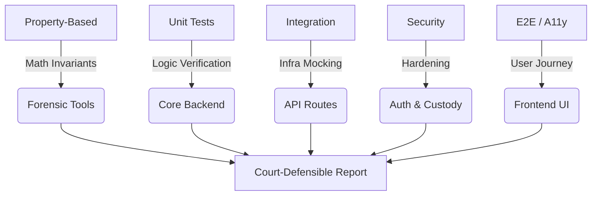

# Testing Guide — Forensic Council

**Version:** v1.9.0 | Comprehensive Forensic & App Testing Reference.

---

## 🏃 Non-Docker Local Build/Run Verification

These commands verify the application starts and responds correctly without Docker for the app layer.

### Backend (Docker infra only)

Start only the infrastructure services (Postgres, Redis, Qdrant) in Docker, then run the API directly on the host:

```bash
# 1. Start infra in Docker (exposes host ports 5432, 6379, 6333)
docker compose -f infra/docker-compose.yml -f infra/docker-compose.dev.yml --env-file .env up -d postgres redis qdrant

# 2. Run backend on host (requires .env with real secrets)
cd apps/api
uv sync --extra dev --extra security --extra observability

# 3. One-time: init database schema and bootstrap users
POSTGRES_HOST=localhost REDIS_HOST=localhost QDRANT_HOST=localhost USE_REDIS_WORKER=false \
  uv run python scripts/init_db.py

# 4. Start API server
POSTGRES_HOST=localhost REDIS_HOST=localhost QDRANT_HOST=localhost USE_REDIS_WORKER=false \
  uv run python scripts/run_api.py

# 5. Verify health
curl -fsS http://localhost:8000/health
# Expected: {"status": "ok"} (or similar 200 with healthy status)
```

### Frontend (host-run)

```bash
cd apps/web
npm ci
npm run dev

# Verify frontend responds
curl -fsS http://localhost:3000/
# Expected: HTTP 200 with HTML

# Verify API proxy reaches backend (200 if backend up, 503 if not)
curl -fsS http://localhost:3000/api/v1/health
```

---

## 🏗️ Test Architecture

The Forensic Council testing suite is designed for **Legal Admissibility**. Every layer, from mathematical forensic invariants to the UI's cryptographic verification, is covered by a multi-modal testing strategy.


```mermaid
graph TD
    A[Property-Based] -->|Math Invariants| B(Forensic Tools)
    C[Unit Tests] -->|Logic Verification| D(Core Backend)
    E[Integration] -->|Infra Mocking| F(API Routes)
    G[Security] -->|Hardening| H(Auth & Custody)
    I[E2E / A11y] -->|User Journey| J(Frontend UI)
    B & D & F & H & J --> K[Court-Defensible Report]
```

---

## 📂 Test Inventory

### ⚖️ Forensic Logic & Mathematical Invariants
| File | Aspect Tested | Dependencies | Coverage |
| :--- | :--- | :--- | :--- |
| `test_forensic_properties.py` | Forensic algorithm robustness | `Hypothesis`, `Pillow`, `NumPy` | Validates ELA/JPEG Ghost invariants across millions of generated inputs (boundary cases, 1x1 images, overflow). |
| `test_forensic_system.py` | Multi-agent pipeline flow | `pytest-asyncio`, Redis Mock | Orchestration of all 5 agents + Arbiter synthesis; verifies context injection (A1 -> A3/A5). |
| `tests/forensics/` | Screenshot, weapon, PNG/lossless, and timeout edge-case tests | `pytest-asyncio`, `Pillow`, `NumPy`, **no Docker/Postgres required** | 18 tests: font inconsistency, UI overlay forgery, weapon category priority, ELA on PNG, agent timeout, ML-subprocess timeout, memory-limit enforcement, OCR resolution scaling. |

### 🛡️ Cryptographic Integrity & Security
| File | Aspect Tested | Dependencies | Coverage |
| :--- | :--- | :--- | :--- |
| `test_custody_chain_integration.py` | Chain of Custody (CoC) | `cryptography`, ECDSA P-256 | Cryptographic linking of hashes; tamper-detection in the PostgreSQL-backed ledger. |
| `test_security.py` | API & JWT Hardening | `PyJWT`, `httpx` | SQLi in Case IDs, JWT `alg=none` attacks, role escalation, and rate-limit enforcement. |
| `test_config_signing_schemas.py` | DTO & Signing Logic | `pydantic`, `ECDSA` | Validates that every report is deterministically signed and schema-compliant. |

### 👤 Authentication & Session State
| File | Aspect Tested | Dependencies | Coverage |
| :--- | :--- | :--- | :--- |
| `test_auth.py` (Backend) | Identity Management | `passlib` (bcrypt) | Password hashing, JWT creation/refresh, and UserRole RBAC guards. |
| `api.test.ts` (Frontend) | Auth Lifecycle | `Jest`, `sessionStorage` | Token storage, auto-login, and header injection for the API client. |
| `schemas_utils.test.ts` | Data Validation | `Zod` | Ensures the frontend rejects malformed agent findings or corrupted reports. |

### 🌐 API & Integration Surface
| File | Aspect Tested | Dependencies | Coverage |
| :--- | :--- | :--- | :--- |
| `test_api_routes.py` | REST Endpoint Health | `FastAPI TestClient`, `magic` | 200/4xx/5xx status codes, MIME-type allow-lists, and CORS header reflection. |
| `websocket_flow.test.ts` | Real-time WebSocket & report polling contracts | `Jest`, WS-Mocks | Unit tests for `createLiveSocket` connect/resolve/reject paths. Lives in `tests/unit/lib/`. |

### ♿ UI & Accessibility (WCAG 2.1 AA)
| File | Aspect Tested | Dependencies | Coverage |
| :--- | :--- | :--- | :--- |
| `accessibility.spec.ts` | Automated A11y Audit | `Playwright`, `axe-core` | Full-page runtime audits; verifies color contrast, heading hierarchy, and modal focus. |
| `components.test.tsx` | UI Interactions | `React Testing Library` | Render states for `AgentProgressDisplay` and `LoadingOverlay`. |

---

## 🚀 Running Tests

### 🐍 Backend (Python 3.12+)
Run from `apps/api` using `uv`:

```bash
# Unit & Property Tests
uv run pytest tests/unit -v

# Integration & Custody Chain
uv run pytest tests/integration -v

# Full local suite, using a workspace temp directory that works on Windows
uv run pytest tests/ -q --tb=short --basetemp .pytest_tmp_run

# Full Coverage Report
uv run pytest tests --cov=. --cov-report=html
```
> [!NOTE]
> Backend tests use a fully mocked infrastructure. No local Postgres or Redis is required to pass these suites.

### ⚛️ Frontend (Next.js 15)
Run from `apps/web`:

```bash
# Jest (Unit & Component A11y)
npm test

# Playwright E2E — fast mocked journey (PR gate, no backend needed)
npm run test:e2e:journey

# Playwright E2E — all tests including accessibility
npm run test:e2e

# Playwright E2E — Chromium only
npm run test:e2e:chromium

# Playwright UI Mode (Visual Debugging)
npx playwright test --ui

# Unit accessibility tests (jest-axe)
npm run test:a11y:unit

# E2E accessibility tests (Playwright axe)
npm run test:a11y:e2e

# Both accessibility test suites
npm run test:a11y
```

On Windows PowerShell, use `npm.cmd` if execution policy blocks `npm.ps1`:

```powershell
npm.cmd run lint
npm.cmd run type-check
npm.cmd test -- --runInBand
npm.cmd run build
```

### 🐋 Infrastructure & Live Connectivity
Run from Project Root:

```bash
# Static build/run verification (docs, hygiene, compile, shell syntax)
./scripts/verify_project.sh static

# Docker compose validation (smoke testing against active dev/prod stacks)
./scripts/verify_project.sh docker-dev
./scripts/verify_project.sh docker-prod

# Full all-targets pass (static + backend + frontend)
./scripts/verify_project.sh all

# Live Stack Integration (Requires 'docker compose up')
docker compose -f infra/docker-compose.yml -f infra/docker-compose.dev.yml --env-file .env ps
```

---

## 📈 Coverage Targets

| Domain | Statements | Functions | Branches |
| :--- | :--- | :--- | :--- |
| **Forensic Core** | 90% | 95% | 85% |
| **Screenshot Forensics** | 90% | 90% | 85% |
| **Timeout / Edge Cases** | 90% | 95% | 80% |
| **Auth & Security** | 100% | 100% | 90% |
| **Frontend UI** | 60% | 60% | 50% |

> [!IMPORTANT]
> **Legal Admissibility Rule**: Any change to forensic logic (`ela_full_image`, `Arbiter`) MUST include a corresponding update to `test_forensic_properties.py` and `test_forensic_system.py`.

---

## 🛠️ Mocking Strategy

1. **Redis**: Mocked via `AsyncMock` in `conftest.py`. Includes support for `pipeline()` and `execute()`.
2. **PostgreSQL**: Mocked via `AsyncMock`. Use the `mock_pg` fixture for custom row returns.
3. **LLMs**: All agent calls to Groq/Gemini are intercepted to prevent API costs and ensure deterministic results during testing.
4. **Time**: Use `freezegun` (backend) or `jest.useFakeTimers()` (frontend) for timestamp-sensitive tests.

---

## 🔍 Troubleshooting Flaky Tests

### 1. E2E Order-Dependent and State Pollution Failures
- **Symptom**: Tests pass individually but fail during a full Playwright Chromium run.
- **Root Cause**: `localStorage` and `sessionStorage` persist in the browser context across tests, leaking active session states and simulation variables.
- **Resolution**:
  - Disable parallel execution in `playwright.config.ts` (`fullyParallel: false` and `workers: 1`).
  - Use `test.describe.serial` for interdependent journeys.
  - Clear context, cookies, and local/session storages in a `beforeEach` hook:
    ```typescript
    test.beforeEach(async ({ page }) => {
      await page.context().clearCookies();
      await page.evaluate(() => {
        window.localStorage.clear();
        window.sessionStorage.clear();
      });
    });
    ```

### 2. Live Playwright Test Hangs (`full_journey.spec.ts`)
- **Symptom**: Test hangs indefinitely on page redirection or during the upload flow.
- **Resolution**:
  - Ensure the backend is fully healthy by waiting for the `/api/v1/health` endpoint:
    ```typescript
    await page.waitForResponse(
      (response) => (response.url().includes("/api/v1/health") || response.url().includes("/health")) && response.status() === 200,
      { timeout: 30_000 }
    );
    ```
  - Guard the upload state with a WebSocket connection handshake check:
    ```typescript
    await page.waitForFunction(() => {
      return window.localStorage.getItem("forensic_ws_connected") === "true" ||
             window.location.pathname.includes("/evidence");
    }, { timeout: 60_000 });
    ```

### 3. Deep Analysis Tool and Subprocess Failures
- **Symptom**: Subprocess timeouts or memory exhaustions during heavy audio or video forensic scans (OpenCV, Numba, ECAPA-TDNN).
- **Resolution**:
  - Enforce intelligent frame-skipping budgets (`skip_rate = max(1, frame_count // 150)`) inside `optical_flow_analyze`.
  - Check video integrity before optical flow operations:
    ```python
    frame_count = int(cap.get(cv2.CAP_PROP_FRAME_COUNT))
    if frame_count <= 0:
        raise ToolUnavailableError(f"Invalid frame count ({frame_count})")
    ```
  - Ensure background worker execution uses graceful timeouts and centralizes fallback logging (e.g. `_audio_artifact()` video track extraction).
